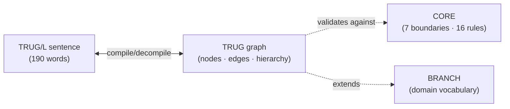

# TRUGS — Traceable Recursive Universal Graph Specification

[](https://pypi.org/project/trugs/)
[](https://pypi.org/project/trugs/)
[](LICENSE)
[](https://github.com/TRUGS-LLC/TRUGS/actions/workflows/compliance.yml)
[](https://doi.org/10.5281/zenodo.19379454)

**Maintained by:** TRUGS LLC

## What is TRUGS?

TRUGS is a JSON graph specification for representing structured information. A TRUG is a JSON file with three components:

1. **Nodes** — typed things (functions, pages, chapters, tasks, parties)
2. **Edges** — named relationships between things (feeds, governs, depends_on)
3. **Hierarchy** — organization via parent/child containment using metric levels

**CORE + BRANCH = Complete TRUG.** CORE defines the universal structure every TRUG must satisfy. BRANCHES define domain-specific vocabularies.



The sentence IS the program. The graph IS the AST. Every valid TRUG/L sentence compiles to a graph losslessly, and every graph decompiles back to a sentence.

## Install

```bash
pip install trugs
```

This gives you the full reference toolchain — `trugs-validate`, `trugs-memory`, `trugs-compliance-check`, and the CRUD tools (`trugs-tget`, `trugs-tupdate`, `trugs-tdelete`, `trugs-tunlink`).

## TRUGS Language

TRUGS includes a formalized subset of English — 190 words drawn from computation and law — where every valid sentence compiles to a TRUG graph and every graph decompiles back to a sentence. Losslessly.

```
PARTY system SHALL FILTER ALL ACTIVE RECORD
  THEN SORT RESULT
  THEN WRITE RESULT TO ENDPOINT output
  OR RETRY BOUNDED 3 WITHIN 60s.
```

Every word is from the vocabulary. The sentence IS the program. The graph IS the AST.

See [TRUGS_LANGUAGE/](TRUGS_LANGUAGE/) for the complete specification.

## Specification

| Document | Description |
|----------|-------------|
| [CORE.md](TRUGS_PROTOCOL/CORE.md) | 7 boundaries, 10 primitive classes (~131 primitives), 16 validation rules, composition type system |
| [BRANCHES.md](TRUGS_PROTOCOL/BRANCHES.md) | Domain-specific vocabularies (Python, Web, Writer, Knowledge, etc.) |
| [SPEC_fundamentals.md](TRUGS_PROTOCOL/SPEC_fundamentals.md) | Core concepts and structure |
| [SPEC_validation.md](TRUGS_PROTOCOL/SPEC_validation.md) | Validation rules with implementations |
| [SCHEMA.md](TRUGS_PROTOCOL/SCHEMA.md) | JSON schema reference |

## Language

| Document | Description |
|----------|-------------|
| [SPEC_vocabulary.md](TRUGS_LANGUAGE/SPEC_vocabulary.md) | 190 words, 8 parts of speech, formal definitions |
| [SPEC_grammar.md](TRUGS_LANGUAGE/SPEC_grammar.md) | BNF grammar, composition rules, 12 validation rules |
| [SPEC_examples.md](TRUGS_LANGUAGE/SPEC_examples.md) | 30 parsed examples across 13 patterns |
| [language.trug.json](TRUGS_LANGUAGE/language.trug.json) | The opening TRUG — the language defining itself |

## Tools

| Tool | Usage | Description |
|------|-------|-------------|
| validate | `python tools/validate.py <file>` | Enforces all 16 CORE rules |
| validate --all | `python tools/validate.py --all <dir>` | Batch validation |
| tget | `python tools/tget.py <file> <node_id>` | Read a node |
| tupdate | `python tools/tupdate.py <file> <node_id> --set key=value` | Update a node |
| tdelete | `python tools/tdelete.py <file> <node_id>` | Delete a node and its edges |
| tunlink | `python tools/tunlink.py <file> --from X --to Y` | Remove an edge |

## Examples

The [EXAMPLES/](EXAMPLES/) directory contains sample TRUGs for 6 domains at varying complexity levels. All 19 examples pass validation.

## This repo, as a TRUG

This repository describes itself as a TRUG. [`folder.trug.json`](folder.trug.json) at the repo root is the machine-readable index — every top-level folder, every reference document, every public tool has a node, with typed edges to the specs and standards it implements or describes.

```bash
# What's in this repo?
trugs-tls folder.trug.json

# What does the compliance checker depend on?
trugs-tget folder.trug.json tools_compliance_check --edges

# Does the graph match the filesystem?
trugs-folder-check .
```

CI runs `trugs-folder-check` on every PR — this README's section list, the spec index, the tool table above all correspond to nodes you can traverse programmatically. When the TRUG drifts from the prose or the filesystem, CI fails. We dogfood our own dogfood.

## Use It

**[TRUGS-AGENT](https://github.com/TRUGS-LLC/TRUGS-AGENT)** — copy one file into your project and your LLM speaks TRL, follows a 9-phase development protocol, tracks projects as graphs, and maintains persistent memory. Seven standalone components:

| Component | What It Does |
|-----------|-------------|
| FOLDER | Machine-readable filesystem index — one JSON graph per folder |
| AAA | 9-phase development protocol — plan before code, audit before ship |
| EPIC | Portfolio tracker as a traversable graph |
| MEMORY | Persistent context across sessions |
| TRUGGING | Methodology for describing a codebase with TRUGs and TRL |
| WEB_HUB | Curated web resource graph |
| NDA | Complete example — all systems applied to a mutual NDA |

## Building on TRUGS

**CORE and Language** are maintained by TRUGS LLC. The 190-word vocabulary, grammar, and validation rules are the specification — they don't change without a spec revision.

**Branches** are where the community builds. If your domain needs vocabulary that doesn't exist (medical, financial, legal, robotics, etc.), build a branch:

1. Define your domain's node types and edge relations
2. Use CORE primitives as your foundation
3. Add domain-specific words to your opening TRUG
4. Validate your TRUGs against CORE

You don't need permission. Build it, use it, share it. Once enough people are using a branch in the same domain, we'll work with the community to formalize it into the specification.

**Implementations** are welcome. Build tools that read, write, validate, or execute TRUGs in any language. The spec is the contract — implement it however you want.

## License

The TRUGS specification and reference tools are released under the [Apache License 2.0](LICENSE). Anyone may implement the standard.
